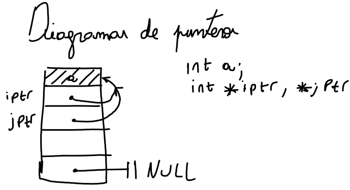

# Pointers(Punteros)

En C para cualquier *type* `T` existe un correspondiente *type* que contiene la
direccion de memoria en donde el objeto de type `T` se guardan. Por eso a estas 
variables se las llama *Punteros* ya que es como si apuntaran a. Por ello los 
punteros son simples variables que que guardan la direccion de memoria donde esta 
guardada ciertos datos, en lugar de guardar los datos en si mismos.

Una de las mejores formas para comunicar y entender la informacion de los punteros
es dibujar diagramas, en lugar de listar las direcciones de memoria dibujamos 
flechas que unen una direccion con otra, cuando el puntero no apunta a nada(o sea a NULL)
se dibuja una doble linea(Como si fuera masa o tierra en electronica).




Cuando declaramos un puntero cierto espacio en memoria es guardado para el. Es 
importante notar que solo se guarda espacio para el puntero(variable) y no hacia
donde apunta. Existe dos maneras de guardar(*allocate*) memoria para nuestros 
datos: una es declarando una variable, la otra dinamicamente utilizando `malloc()`
o `realloc()` como sabemos cuando declaramos una variable, su *type* le dice al 
compilador cuanta memoria guardar, esta memoria se guarda automaticamente pero 
puede que no dure toda la vida del programa, esto es importante cuando tratamos
con punteros a *variables automaticas*, estas variables son aquellas cuyo almacenamiento
es *allocate* y *deallocate* cuando entran o dejan una funcion o un bloque delimitador.

Por ejemplo ya que en el siguiente caso `iptr` es asociado a una variable automatica `a`
en la siguiente funcion `f` entonces `iptr` se convierte en un puntero colgado(*dangling pointer*)
    
```C
int f(int **iptr)
{
    int a = 10;
    *iptr = &a;

    return 0;
}
    
```
O sea que le estamos dando la dirección de memoria de una variable que va a desaparecer!!!

# Agrupamiento de datos en `C`

Uno de los usos mas frecuentes de los punteros en `C` es el de referenciar datos
`C` soporta dos tipos de agrupamiento: *structs* y *arrays*. Como sabemos las 
*structs* son agrupamientos de datos heterogéneos que pueden ser tratados juntos 
como un solo tipo de dato. Los punteros a *structs* son una parte importante para
construir los tipos de datos mas conocidos. Como ejemplo podemos hablar de las 
listas enlazadas(*linking lists*), la estructura de dichas listas es por cada 
elemento de la lista tenemos una *struct* `ListElmt`
```C
typedef struct ListElmt_
{
    void *data;
    struct ListElmt_ *next;
}ListElmt;
```
La cual posee un puntero `*data` que apunta a la dirección de los datos y un 
puntero a la próxima *struct* `*next` el cual apunta a la próxima lista de datos
, si es la ultima apuntara a `NULL`. Un aspecto importante de las *struct* es 
que no pueden contener instancias de si misma, pero si punteros a instancias de 
si misma como es el caso de `ListElmt`


## *Arrays*
Los *arrays* son secuencia de elementos homogéneos distribuidos consecutivamente
en memoria. Como sabemos en `C` los *arrays* están muy ligados a los punteros ya
que cuando una expresión de *array* ocurre el lenguaje automáticamente convierte 
a este en un puntero que apunta al primer elemento del *array*. O sea que existe
una relación entre: `a[i]`  y `*(a + i)`  que también vale para matrices`*(*(a + i) + j)`
Podemos pasar *arrays* multidimensionales pero debemos indicarle al compilador
el numero de elementos que hay en la primer dimensión, por ejemplo para una matriz
de $2\times 3$ 
```C
int g(int a[][2])
{
    a[2][0] = 5;
    return 0;
}

```
## Punteros como parámetro de funciones

Los punteros son utilizados para pasar a las funciones parámetros por referencia
en lugar de por valor(ya que si por ejemplo tenemos un *array* grande este primero
se copia y luego se pasa a la función). 

## Punteros a punteros como parámetro de funciones

Una situación en la que una función debe modificar un puntero que le es pasado
como parámetro, es propicia para utilizar un puntero que apunte a ese puntero 
para asi poder modificarlo. Por ejemplo en la siguiente función:
`int list_rem_next(List *list, ListElmt *element, void **data);`
ya que la operacion debe modificar el puntero `*data` para hacer que apunte hacia
los datos removidos. A veces no es importante el *type* del puntero, por ello 
podemos definir punteros genéricos. 


## Punteros genericos

En `C` solo podemos hacer asignaciones de punteros del mismo *type*, por ejemplo
si tenemos un puntero de `char` `sptr` y queremos asignarlo a un puntero de `int`
`iptr` no podremos. Sin embargo los punteros genéricos(`gptr`) pueden ser asignados a 
cualquier *type*. Para realizar un puntero genérico solo debemos declararlo como
`void`

## *Cast*

Para hacer que una variable `t` del *type* `T` se convierta temporalmente en otro
*type* `S` debemos preceder `t` con `S` en un paréntesis. Por ejemplo si queremos
asignar a un puntero a entero (`iptr`) a un puntero a `float` (`fptr`):
```C
fptr = (float *)iptr;
```
*cast* es especialmente importante para los punteros genéricos, ya que ellos no 
pueden desreferenciarse sin *cast* esto es porque los punteros genéricos no le dan
información sobre a donde están apuntando. Tambien sirven para auto documentar el 
código cuando un puntero genérico es asignado a un puntero de otro *type*, aunque
el *cast* no es necesario en este caso, mejora la legibilidad de nuestro código.

## Punteros a funciones

Punteros a funciones son punteros que en lugar de apuntar a datos, apuntan a codigo
ejecutable o a bloques de información que necesitan llamar a código ejecutable. 
Se usan para tratar a las funciones como si fueran datos. La declaración de un puntero
a función es parecido a la declaración de una función normal excepto que aparece 
un asterisco antes del nombre de la función y este asterisco se encierra con un 
paréntesis por razones de asociatividad. Por ejemplo el siguiente código, `match`
 es declarado como un puntero a una función que acepta dos punteros genéricos y 
 devuelve un entero.

```c
int (*match)(void *key1, void *key2);
```

 Esta declaración significa que podemos *set* `match` para que apunte a cualquier
 función que acepte como entrada dos punteros genéricos y como salida sea un `int`.
 Por ejemplo supongamos que tenemos `match_int` que es una función que acepta 
 las condiciones de `match` y retorna un `1` si los enteros coinciden y cero en otro
 caso asumiendo que ya la hemos declarado en algún lugar, entonces podemos hacer 
 que `match` apunte a esta función de la siguiente manera:

```c
 match = match_int;
```
Y ahora podemos usar en el código a `match` como si fuera una función normal, o
sea:

```c 
retval = match(&x, &y);
```
## Recursividad

La recursividad la podemos encontrar en todas partes, la naturaleza esta llena
de ejemplos(las hojas de un arbol por ejemplo). En el contexto de computación la 
recursividad se puede lograr con funciones que se llaman a si mismas.

